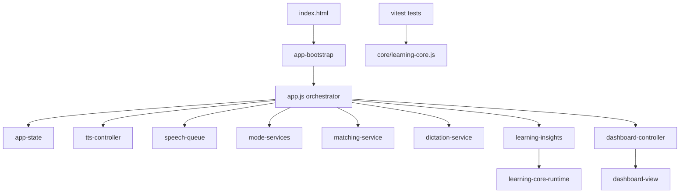

# 儿童英语乐园

基于纯前端实现的儿童英语学习应用，支持按主题分类学习与多种互动练习模式。

## 功能概览

- 卡片认读：浏览单词卡片，点击朗读单词与例句
- 看词选图：听读/看词后在图片中选择正确答案
- 配对连线：将单词与对应图片进行配对
- 听写训练：播放单词后用字母卡片拼写答案
- 学习辅助：本地保存学习进度、星星奖励、语音速度与音色偏好
- 词量档位：幼儿版 / 小学版词汇过滤

## 项目结构

```text
.
├─ index.html                 # 单页入口与内联样式
├─ js/
│  ├─ app.js                  # 业务编排入口（模式切换、状态流转）
│  ├─ core/
│  │  └─ learning-core.js     # 可测试核心函数（准确率、错题操作、排序）
│  └─ modules/                # 运行时模块（controller/service）
│     ├─ app-bootstrap.js
│     ├─ app-state.js
│     ├─ dashboard-controller.js
│     ├─ dashboard-view.js
│     ├─ dictation-service.js
│     ├─ learning-core-runtime.js
│     ├─ learning-insights.js
│     ├─ matching-service.js
│     ├─ mode-services.js
│     ├─ speech-queue.js
│     └─ tts-controller.js
├─ images/                    # 词汇图片资源（优先 webp）
├─ scripts/
│  └─ generate-missing-images.mjs  # 缺失图片生成脚本（Pollinations + sharp）
├─ tests/
│  └─ learning-core.test.js   # 核心逻辑测试
└─ package.json
```

## 当前架构

核心设计：`app.js` 负责流程编排，具体能力下沉到 `modules`，纯逻辑放到 `core` 便于测试。



### 模块职责速览

- `app-bootstrap`：启动顺序与事件绑定集中管理
- `app-state`：应用状态对象创建
- `tts-controller`：语音设置、音色列表、控件绑定
- `speech-queue`：语音队列播放与错误恢复
- `mode-services`：模式级决策（如听写选题、配对检查态）
- `matching-service`：配对模式判定逻辑
- `dictation-service`：听写回合生命周期
- `learning-insights`：学习统计与错题本存储
- `dashboard-view/controller`：统计面板渲染与交互绑定
- `core/learning-core.js`：与运行时解耦的纯函数，供测试复用

## 本地运行

本项目为静态站点，可直接通过本地静态服务器打开。

### 方式 1：VS Code / Cursor Live Server

1. 打开项目根目录
2. 启动 `index.html` 的 Live Server

### 方式 2：Node 简易服务器

```bash
npx serve .
```

启动后访问终端提示的本地地址（如 `http://localhost:3000`）。

## 脚本命令

先安装依赖：

```bash
npm install
```

可用命令：

- `npm run generate-images:dry`：仅预览将要生成的图片
- `npm run generate-images`：生成缺失词汇图片（WebP）
- `npm run lint`：检查核心业务与模块代码质量
- `npm run test`：运行单元测试（Vitest）

## 图片资源策略

运行时图片加载顺序：

1. `webp`
2. `png`
3. 在线 AI 回退图（公开接口）

离线或网络受限场景下，建议提前用脚本生成本地图片资源。

## 已知限制

- `app.js` 仍较大，后续继续按功能域拆分
- 测试目前以核心纯函数为主，UI 交互自动化仍需补充
- 某些浏览器下语音引擎首次调用可能有延迟（已做 warmup）

## 开发路线（简版）

- M1：稳定性修复 + 文档与冒烟验证
- M2：代码模块化 + 质量门禁（lint/test）
- M3：错题复练、学习统计、性能优化